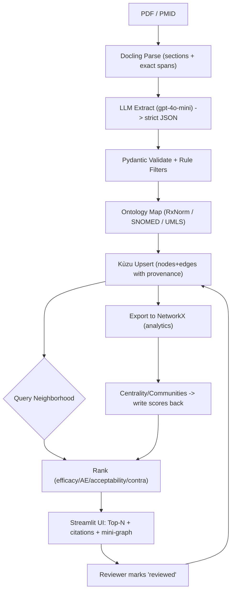

# Brightside Health AI Studio — Clinical Knowledge Graph (MVP)

> Build a trustworthy, clinician-facing knowledge graph (KG) from depression/anxiety papers.
> **MVP flow:** Docling → LLM extraction → validation → ontology grounding → **Kùzu** graph → **Streamlit** UI.
> **Stretch (later):** ClinicalBERT embeddings, LangGraph, link-prediction.

---

## Why this exists

Clinicians are overwhelmed by literature. We extract evidence from papers, normalize to medical ontologies, store facts **with provenance**, and surface ranked options with citations. The system is small-team friendly, runs locally on any OS, and is easy to extend.

---

## Architecture (end-to-end)



**Phase purposes (one-liners):**

- **Ingest (Docling):** turn any paper into sectioned text with exact sentence spans.
- **Extract (LLM):** convert text into JSON triples (Drug–Relation→Target) with provenance.
- **Validate:** enforce schema/rules so junk can’t enter the graph.
- **Normalize:** map strings → RxNorm/SNOMED/UMLS (merge synonyms).
- **Store:** **Kùzu** graph with edge provenance (`source_id`, `section`, `span`, `confidence`, `reviewed`).
- **Query:** condition neighborhood + provenance drill-downs.
- **Rank:** transparent scoring (configurable weights).
- **Visualize:** Streamlit UI with ranked options, citations, mini-graph, review toggle.
- **Analytics (optional):** NetworkX centrality/communities → write results back to Kùzu.

---

## Tech stack

Docling · OpenAI **gpt-4o-mini** · Pydantic · UMLS/RxNorm/SNOMED · **Kùzu** (store/query) · **NetworkX** (analytics) · **Streamlit** (UI)

---

## Repository structure

```
brightside-kg/
├─ README.md
├─ .gitignore
├─ .env.example                   # OPENAI_API_KEY, KG_DB_PATH, LOG_LEVEL
├─ requirements.txt or pyproject.toml
├─ Makefile                       # macOS/Linux shortcuts (Windows: scripts/tasks.ps1)
├─ docker-compose.yml             # (optional) container runtime
├─ docker/                        # (optional) Dockerfile
│  └─ Dockerfile
├─ configs/
│  ├─ app.yaml                    # paths/feature flags
│  ├─ weights.yaml                # ranking weights (w1..w5)
│  ├─ relations.yaml              # allowed relations + required edge props
│  └─ mappings.yaml               # ontology provider config
├─ data/
│  ├─ raw_papers/                 # input PDFs
│  ├─ interim/                    # extracted triples (pre-normalization)
│  ├─ processed/                  # normalized triples (IDs)
│  └─ kg_db/                      # Kùzu database folder
├─ scripts/
│  ├─ add_paper.py                # parse→extract→validate→normalize→upsert (one command)
│  ├─ export_nodes_edges.py       # CSV/JSONL export (QA/Neo4j later)
│  └─ tasks.ps1                   # Windows equivalents of Make targets
├─ src/
│  ├─ app/streamlit_app.py        # UI (search, ranking, citations, mini-graph, review)
│  ├─ core/
│  │  ├─ ingest_docling.py        # Docling adapter → sections/spans/metadata
│  │  ├─ extract_llm.py           # LLM calls → strict JSON (retries, caching)
│  │  ├─ validate.py              # Pydantic + rule filters
│  │  ├─ normalize_ontology.py    # RxNorm/SNOMED/UMLS mapping; synonym merge
│  │  ├─ graph_store.py           # Neo4j schema/upserts/queries (source of truth)
│  │  ├─ queries.py               # neighborhood + provenance helpers
│  │  ├─ rank.py                  # transparent scoring using configs/weights.yaml
│  │  └─ review.py                # mark edges reviewed
│  ├─ analytics/networkx_sidecar.py
│  ├─ schemas/triples.py          # Pydantic models (Triple, Outcome, SideEffect, EffectSize)
│  └─ utils/{io.py,hashing.py,logging.py,timers.py}
├─ tests/
│  ├─ test_graph_store.py
│  ├─ test_validate.py
│  └─ test_pipeline_smoke.py
├─ eval/{gold_edges_sample.jsonl,reports/}
└─ docs/{architecture.md,prompts.md,ontology_notes.md}
```

**What each core part owns:**

- `ingest_docling.py` — sectioned text + spans + metadata (**provenance preserved**).
- `extract_llm.py` — strict JSON triples, retries/caching.
- `validate.py` — schema/rules (allowed relations, span sanity).
- `normalize_ontology.py` — string→ID mapping (RxNorm/SNOMED/UMLS), synonym merge.
- `graph_store.py` — create schema, upsert/read; keep **all DB calls here**.
- `queries.py` — stable read patterns for UI/logic.
- `rank.py` — multi-objective score (efficacy↑, AE burden↓, acceptability↑, evidence↑, contra↓).
- `streamlit_app.py` — clinician UI, citations, review toggle.
- `networkx_sidecar.py` — optional analytics; write metrics back to Kùzu.

---

## Getting started (env + run)

### Prerequisites

- Python **3.11+**
- macOS/Linux: `make`; Windows: PowerShell
- Advisor will provide **OPENAI_API_KEY** (mock extractor works without it for smoke test)

### 1) Clone

```bash
git clone <YOUR_REPO_URL> brightside-kg
cd brightside-kg
```

### 2) Set up the environment

**Option A — pip/uv (recommended)**

```bash
# macOS/Linux
make setup
# (does: install deps, copy .env.example → .env, mkdir data/kg_db)
```

Windows PowerShell:

```powershell
./scripts/tasks.ps1 -Task setup
```

> If you prefer plain `pip`:
>
> ```bash
> python -m venv .venv && source .venv/bin/activate   # (Windows: .venv\Scripts\activate)
> pip install -r requirements.txt
> cp .env.example .env
> python - <<'PY'
> import os; os.makedirs('data/kg_db', exist_ok=True)
> PY
> ```

**Option B — Conda (team choice)**

```bash
conda env create -f environment.yml        # ensure Python 3.11 in the file
conda activate brightside-health-ai
cp .env.example .env
mkdir -p data/kg_db
```

### 3) Configure

Edit `.env`:

```env
OPENAI_API_KEY=sk-...
KG_DB_PATH=./data/kg_db
LOG_LEVEL=INFO
```

### 4) Add a paper (end-to-end ingest)

```bash
# put a PDF in data/raw_papers/
cp /path/to/any.pdf data/raw_papers/sample.pdf

# run the pipeline (parse → extract → validate → normalize → upsert)
make add_paper ARGS="--pdf data/raw_papers/sample.pdf"
```

Windows:

```powershell
./scripts/tasks.ps1 -Task add_paper -Args "--pdf data/raw_papers/sample.pdf"
```

### 5) Launch the UI

```bash
make ui
# open http://localhost:8501
```

Windows:

```powershell
./scripts/tasks.ps1 -Task ui
```

---

## Common tasks

```bash
make add_paper ARGS="--pdf data/raw_papers/another.pdf"   # ingest a new paper
make test                                                  # run tests
make fmt && make lint                                      # format & lint
make resetdb                                               # wipe Kùzu DB
```

---

## Configuration knobs

- **Ranking weights:** `configs/weights.yaml`
- **Allowed relations & required edge props:** `configs/relations.yaml`
- **Paths & feature flags:** `configs/app.yaml`
- **Ontology provider prefs:** `configs/mappings.yaml`

Change configs → restart UI (no code edits needed).

---

## Docker (optional)

Use Docker if onboarding is painful or for hosted demos.

```bash
docker compose up --build
# add a paper in a one-off worker (if compose defines it)
docker compose run --rm --profile offline worker --pdf /app/data/raw_papers/yourfile.pdf
```

Compose mounts `./data` → `/app/data`, so the **Kùzu DB** and PDFs persist on the host.

---

## Sprints (condensed)

- **Sprint 1 — MVP:** Docling → LLM (JSON) → normalize → Kùzu → Streamlit; one neighborhood query; \~85% precision on 30–50 edge sample.
- **Sprint 2 — Polish & “any paper”:** `add_paper` CLI, reviewed flag in UI, contraindication chips, optional NetworkX metrics.
- **Sprint 3 — Stretch:** ClinicalBERT embeddings (clustering/dedup/context), Embedding Projector (internal), light LangGraph, link-prediction heuristic.

---

## Definition of Done (MVP)

- `add_paper` creates edges with `{source_id, section, span, confidence}` and mapped IDs.
- Streamlit shows **ranked options** with **citations + exact spans** and a mini-graph.
- A second paper ingests without code changes and merges correctly.
- QA sample (\~30–50 edges) shows acceptable precision.

---

## Troubleshooting

- **Invalid LLM JSON:** tighten prompt; Pydantic parse + retry; log rejects to `data/interim/`.
- **Duplicates:** hash `(source_id + span)` before writing edges.
- **Ontology mapping slow:** start with small local maps; add API lookups later.
- **Nothing appears in UI:** confirm `KG_DB_PATH` exists, ingest ran, and condition ID matches mapping.

---

## Contributing

- Keep all DB access in `src/core/graph_store.py`.
- Keep prompt/schema contracts in `docs/prompts.md`.
- Update tests when changing schemas or queries.
- Prefer config over code for weights and relation vocab.

---
