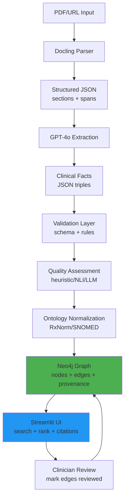

# Brightside Health AI Studio - Clinical Knowledge Graph


> **Build a clinician-facing knowledge graph from depression/anxiety research papers.**  
> **Pipeline:** Docling → GPT-4o extraction → validation → quality assessment → ontology normalization → **Neo4j** graph → **Streamlit** UI  
> **Goal:** Surface evidence-based treatment options with **full provenance** (paper citations, exact text spans, confidence scores)

---

## 🎯 Why This Exists

**Problem:** Clinicians are overwhelmed by research literature. Finding evidence for treatment decisions requires hours of manual search across scattered papers.

**Solution:** Automatically extract clinical facts (drug-condition relationships, efficacy, side effects) from papers, normalize to medical ontologies (RxNorm/SNOMED), store in a queryable graph database, and present ranked treatment options with citations.

**Key Features:**

- **Provenance-first:** Every fact links back to source paper, section, and exact text span
- **Multi-method validation:** Heuristic rules + semantic similarity + optional LLM judge
- **Human-in-the-loop:** Manual approval gates between pipeline stages via Streamlit UI
- **Ontology grounding:** Maps drug/condition names to standard medical codes
- **Transparent ranking:** Configurable weights for efficacy, safety, acceptability

---

## Architecture (End-to-End)



**Pipeline Stages:**

1. **Parse (Docling)** → Extract structured text with section headers and sentence offsets
2. **Extract (LLM)** → GPT-4o converts text into JSON triples: `(drug, relation, condition/outcome)`
3. **Validate** → Pydantic schema + rule filters (required fields, entity types, span checks)
4. **Quality Check** → Multi-method assessment (heuristic/NLI/LLM judge) estimates precision
5. **Normalize** → Map drug/condition strings to RxNorm/SNOMED IDs for entity merging
6. **Load to Graph** → Upsert nodes and edges into Neo4j with full provenance metadata
7. **UI (Streamlit)** → Human-in-the-loop control panel for running and monitoring pipeline

---

## Tech Stack

| Component              | Technology                                  | Purpose                                           |
| ---------------------- | ------------------------------------------- | ------------------------------------------------- |
| **PDF Parsing**        | [Docling](https://github.com/DS4SD/docling) | Extracts structured text with layouts preserved   |
| **LLM Extraction**     | OpenAI GPT-4o                               | Converts text to structured JSON facts            |
| **Validation**         | Pydantic + Custom Rules                     | Schema enforcement and quality filters            |
| **Quality Assessment** | Heuristic + sentence-transformers + GPT-4o  | Multi-method fact verification                    |
| **Ontology Mapping**   | RxNorm / SNOMED CT / UMLS                   | Standardizes medical terminology                  |
| **Graph Database**     | Neo4j 5.x                                   | Stores entities and relationships with provenance |
| **User Interface**     | Streamlit                                   | Interactive pipeline control and visualization    |
| **Language**           | Python 3.11+                                | Core runtime                                      |

---

## 📁 Repository Structure

```
brightside-health-ai/
├── README.md                          # This file
├── .env.example                       # Environment template (API keys, DB config)
├── .gitignore
├── requirements.txt                   # Python dependencies
├── Makefile                          # macOS/Linux shortcuts
│
├── configs/                          # Configuration files
│   ├── app.yaml                      # Paths and feature flags
│   ├── mappings.yaml                 # Ontology mapping rules (RxNorm/SNOMED)
│   ├── relations.yaml                # Valid relationship types
│   └── weights.yaml                  # Ranking weights (efficacy/safety/acceptability)
│
├── data/                             # Data directories (gitignored)
│   ├── raw_papers/                   # Input PDFs
│   ├── interim/                      # Parsed documents (JSON)
│   ├── processed/
│   │   ├── extracted/                # LLM-extracted facts
│   │   ├── validated/                # Schema-validated facts
│   │   └── normalized/               # Ontology-normalized facts
│   ├── eval/                         # Quality assessment reports
│   └── reports/                      # Batch processing summaries
│
├── scripts/                          # Command-line tools
│   ├── add_paper.py                  # End-to-end pipeline runner
│   ├── parse_doc.py                  # Parse PDF to JSON
│   ├── extract.py                    # Extract facts with LLM
│   ├── validate.py                   # Validate extracted facts
│   ├── auto_validate_quality.py      # Quality assessment
│   ├── normalize.py                  # Ontology normalization
│   ├── load_neo4j.py                 # Load facts into Neo4j
│   ├── show_unmatched_normalized.py  # Show unmapped entities
│   ├── neo4j_schema.py               # Neo4j schema inspector
│   ├── neo4j_validate.py             # Neo4j data quality checks
│   └── tasks.ps1                     # Windows PowerShell scripts
│
└─── src/
    ├── app/
    │   └── streamlit_app.py          # Main UI application
    ├── core/
    │   ├── ingest_docling.py         # PDF parsing logic
    │   ├── extract_llm.py            # LLM extraction pipeline
    │   ├── validate.py               # Validation rules and logic
    │   └── normalize_ontology.py     # Ontology mapping
    ├── analytics/
    │   └── networkx_sidecar.py       # Graph analytics (future implementations)
    └── utils/                        # Shared utilities

```

---

## 🔎 Demo Snapshot (Pre-run Example)

A snapshot of the knowledge graph for demonstration purposes:

- View: https://graphxr.kineviz.com/share/69223a6664d44cc4b9506b1f/Brightside/693b2fb1729dbcca686fda9f/Knowledge%20Graph
- Note: This is a pre-run example to illustrate structure and relationships.

---

## 🚀 Getting Started

### Prerequisites

- **Python 3.11+** (tested on 3.11, 3.12)
- **Neo4j 5.x** (Community or Enterprise)
  - Download: https://neo4j.com/download/
- **OpenAI API Key** (for GPT-4o extraction)
- **Git**

---

### Step 1: Clone the Repository

```bash
git clone https://github.com/your-org/brightside-health-ai.git
cd brightside-health-ai
```

---

### Step 2: Set Up Python Environment

**Option A: Manual Setup (recommended)**

```bash
# Create virtual environment
python -m venv .venv

# Activate (macOS/Linux)
source .venv/bin/activate

# Activate (Windows)
.venv\Scripts\activate

# Install dependencies
pip install -r requirements.txt

# Copy environment template
cp .env.example .env

# Create data directories
mkdir -p data/raw_papers data/interim data/processed/extracted data/processed/validated data/processed/normalized data/eval data/reports
```

**Option B: Using PowerShell (Windows)**

```powershell
./scripts/tasks.ps1 -Task setup
```

**Option C (Dont use needs fixing): Using Make (macOS/Linux)**

```bash
make setup
# Installs dependencies, creates .env file, creates data directories
```

---

### Step 3: Configure Environment Variables

Edit .env file:

```env
# OpenAI API Configuration
OPENAI_API_KEY=sk-proj-your-api-key-here

# Neo4j Configuration
NEO4J_URI=bolt://localhost:7687
NEO4J_USER=neo4j
NEO4J_PASSWORD=your-password-here

# Optional: Logging
LOG_LEVEL=INFO
```

---

### Step 4: Start Neo4j Database

**Option A: Neo4j Desktop (Recommended for Development)**

1. Download Neo4j Desktop from https://neo4j.com/download/
2. Install and create a new project
3. Click "Add" → "Local DBMS"
4. Set database name (e.g., `brightside-kg`)
5. Set password (remember this!)
6. Click "Create"
7. Click "Start" on your database
8. Note the Bolt URI (usually `bolt://localhost:7687`)

**Option B: Neo4j Cloud (AuraDB - Production)**

1. Create free instance at https://console.neo4j.io/
2. Copy connection URI (e.g., `neo4j+s://xxxxx.databases.neo4j.io`)
3. Save credentials securely

**Verify Connection:**

- Browser UI: http://localhost:7474
- Or run: `curl http://localhost:7474`

**Update .env file with your Neo4j credentials:**

```env
NEO4J_URI=bolt://localhost:7687
NEO4J_USER=neo4j
NEO4J_PASSWORD=your-password-here
```

---

## Two Ways to Run the Pipeline

### **Option 1: Streamlit UI (Recommended - Human-in-the-Loop)**

The Streamlit UI provides an interactive, stage-by-stage interface with manual approval gates.

**Launch:**

```bash
# macOS/Linux
make ui

# Windows
./scripts/tasks.ps1 -Task ui

# Or direct command
streamlit run src/app/streamlit_app.py
```

Open browser to: **http://localhost:8501**

**UI Features:**

- 📄 **Paper Input:** Upload PDF, enter URL, or select from raw_papers
- ⚙️ **Pipeline Settings:** Quality thresholds, fuzzy matching scores, assessment methods
- 🔌 **Neo4j Connection:** Test database connection before loading
- 📊 **Stage-by-Stage Execution:** Manual approval required between stages
- 🔍 **Preview & Statistics:** View outputs, quality scores, and validation issues
- 🎯 **Progress Tracking:** Visual pipeline progress indicator

**Pipeline Stages in UI:**

1. **Parse Document** → Convert PDF to structured JSON
2. **Extract Facts** → GPT-4o extraction (costs API calls)
3. **Validate Facts** → Schema and rule checks
4. **Quality Assessment** → Multi-method verification (select methods)
5. **Normalize** → Map to RxNorm/SNOMED
6. **Load to Graph** → Insert into Neo4j (with pre-flight checks)

**After completion:**

- View quality reports
- Check unmatched terms
- Open Neo4j Browser to query graph

---

### **Option 2: Command-Line Scripts (Automated)**

For batch processing or automation, run scripts manually in sequence.

#### **Quick Start: Process One Paper**

```bash
# Place a PDF in data/raw_papers/
cp path/to/paper.pdf data/raw_papers/sample.pdf

# Run full pipeline
make add_paper ARGS="--pdf data/raw_papers/sample.pdf"
```

**Windows:**

```powershell
./scripts/tasks.ps1 -Task add_paper -Args "--pdf data/raw_papers/sample.pdf"
```

**What it does:**

1. Parses PDF → `data/interim/sample_parsed.json`
2. Extracts facts → `data/processed/extracted/sample_extracted.json`
3. Validates → `data/processed/validated/sample_validated.json`
4. Assesses quality → `data/eval/sample_quality_report.json`
5. Normalizes → `data/processed/normalized/sample_normalized.json`

**Then manually load to Neo4j:**

```bash
python scripts/load_neo4j.py \
  --input data/processed/normalized/sample_normalized.json \
  --clear  # Use --clear only for first paper to delete existing data
```

---

## 📋 Manual Pipeline Steps (For Testing/Debugging)

Run each stage independently to understand or debug the pipeline:

### **Stage 1: Parse Document**

**Purpose:** Extract structured text with sections and sentence spans

```bash
python scripts/parse_doc.py \
  --source data/raw_papers/sample.pdf \
  --out data/interim/sample_parsed.json
```

**Output:** `data/interim/sample_parsed.json`

**What it does:**

- Uses Docling to extract text while preserving structure
- Identifies sections (Abstract, Introduction, Methods, Results, Discussion)
- Splits text into sentences with character offsets
- Preserves metadata (source_id, title, year)

**Example output structure:**

```json
{
  "full_text": "...",
  "sections": [
    {
      "name": "results",
      "text": "...",
      "start_offset": 1234,
      "end_offset": 2345,
      "sentences": [{ "text": "...", "start": 1290, "end": 1320 }]
    }
  ],
  "metadata": { "source_id": "sample", "title": "...", "year": 2024 }
}
```

---

### **Stage 2: Extract Facts**

**Purpose:** Use GPT-4o to extract clinical facts as JSON triples

```bash
python scripts/extract.py \
  --input data/interim/sample_parsed.json \
  --output data/processed/extracted/sample_extracted.json
```

**Output:** `data/processed/extracted/sample_extracted.json`

**What it does:**

- Sends each section to GPT-4o with structured prompt
- Extracts facts as `(drug_name, relation, condition_name)` triples
- Captures provenance: `span` (exact text), `section`, `confidence`
- Includes optional fields: `treatment_line`, `sample_size`, `study_design`, `dose`, `duration`, `p_value`

**Example fact:**

```json
{
  "drug_name": "escitalopram",
  "condition_name": "major depressive disorder",
  "relation": "FIRST_LINE_FOR",
  "outcome": "remission rate",
  "effect_size": "42% vs 28% placebo, NNT=7",
  "confidence": 0.95,
  "study_design": "RCT",
  "sample_size": 485,
  "duration": "8 weeks",
  "dose": "10-20mg daily",
  "treatment_line": "first",
  "p_value": 0.001,
  "span": "In an 8-week randomized trial (n=485)...",
  "source_id": "sample",
  "section": "Results"
}
```

**Supported relations:**

- `TREATS`, `IMPROVES`, `FIRST_LINE_FOR`, `MAINTENANCE_FOR`
- `PREVENTS_RELAPSE_IN`, `WELL_TOLERATED_IN`, `EFFECTIVE_IN_SUBGROUP`
- `ASSOCIATED_WITH_SE`, `CONTRAINDICATED_FOR`
- `AUGMENTS`, `SUPERIOR_TO`, `EQUIVALENT_TO`

---

### **Stage 3: Validate Facts**

**Purpose:** Check facts against schema and filter invalid entries

```bash
python scripts/validate.py \
  --input data/processed/extracted/sample_extracted.json \
  --output data/processed/validated/sample_validated.json \
  --issues data/processed/validated/sample_issues.json \
  --show-details
```

**Output:**

- `data/processed/validated/sample_validated.json` (clean facts)
- `data/processed/validated/sample_issues.json` (rejected facts with reasons)

**What it validates:**

- Required fields present: `drug_name`, `condition_name`, `relation`, `span`, `confidence`
- Confidence in valid range: 0.0 to 1.0
- Drug name not generic ("medication", "treatment")
- Condition name not an outcome ("remission", "response")
- Relation type in allowed list
- Drug mentioned in span (strict check)
- Condition mentioned in span (lenient check)
- Side effects specific (not "side effects")
- Span not too short (<15 chars) or too long (>500 chars)

**Common rejection reasons:**

- `outcome_as_condition`: "remission" used as condition
- `placeholder_drug_name`: "medication" instead of specific drug
- `drug_not_in_span_strict`: Drug name not found in supporting text
- `invalid_side_effects`: Generic "side effects" instead of specific events

---

### **Stage 4: Quality Assessment**

**Purpose:** Estimate precision using multiple validation methods

```bash
# Heuristic only (fast, free)
python scripts/auto_validate_quality.py \
  --input data/processed/validated/sample_validated.json \
  --output data/eval/sample_quality_report.json \
  --methods heuristic

# Multiple methods (more accurate)
python scripts/auto_validate_quality.py \
  --input data/processed/validated/sample_validated.json \
  --output data/eval/sample_quality_report.json \
  --methods heuristic nli llm_judge
```

**Available methods:**

| Method           | Speed        | Cost               | Accuracy      | Use Case                                             |
| ---------------- | ------------ | ------------------ | ------------- | ---------------------------------------------------- |
| `heuristic`      | ⚡ Fast      | FREE               | 70-80%        | Default quick check                                  |
| `nli`            | 🐢 Slow      | FREE               | 80-90%        | Semantic similarity (requires sentence-transformers) |
| `llm_judge`      | 🐌 Very Slow | $$$ (~$0.001/fact) | 90-95%        | High-stakes verification                             |
| `knowledge_base` | ⚡ Fast      | FREE               | 100% on known | Cross-reference against curated list                 |

**Output:** `data/eval/sample_quality_report.json`

**What it contains:**

```json
{
  "total_facts": 50,
  "average_quality_score": 78.5,
  "estimated_precision": 0.92,
  "results": [
    {
      "fact": {...},
      "quality_score": 85,
      "likely_correct": true,
      "method_results": {
        "heuristic": {"quality_score": 80, "likely_correct": true},
        "nli": {"quality_score": 90, "likely_correct": true}
      }
    }
  ]
}
```

---

### **Stage 5: Normalize to Ontologies**

**Purpose:** Map drug/condition names to standard medical codes

```bash
python scripts/normalize.py \
  --input data/processed/validated/sample_validated.json \
  --output data/processed/normalized/sample_normalized.json \
  --config configs/mappings.yaml \
  --min-fuzzy-score 0.86
```

**Output:** `data/processed/normalized/sample_normalized.json`

**What it does:**

- Maps drug names to **RxNorm** concept IDs
- Maps condition names to **SNOMED CT** concept IDs
- Uses exact matching first, then fuzzy matching (RapidFuzz)
- Preserves original raw fact for reference
- Stores match type: `exact`, `fuzzy`, or `unmatched`
- Stores match score (0.0 to 1.0)

**Example normalized fact:**

```json
{
  "drug": {
    "text": "escitalopram",
    "concept_id": "RXNORM:321988",
    "label": "Escitalopram",
    "match_type": "exact",
    "score": 1.0
  },
  "condition": {
    "text": "major depressive disorder",
    "concept_id": "SNOMED:370143000",
    "label": "Major depressive disorder",
    "match_type": "fuzzy",
    "score": 0.91
  },
  "relation": {"text": "FIRST_LINE_FOR"},
  "raw_fact": {
    "drug_name": "escitalopram",
    "condition_name": "major depressive disorder",
    ...
  }
}
```

**Check for unmapped entities:**

```bash
python scripts/show_unmatched_normalized.py \
  --input data/processed/normalized/sample_normalized.json
```

This shows:

- Unmatched drugs with occurrence counts
- Unmatched conditions
- Unmatched outcomes
- Unmatched side effects

**To improve matching:**

1. Add missing terms to mappings.yaml
2. Run normalization again
3. Goal: >95% match rate

---

### **Stage 6: Load into Neo4j Graph**

**Purpose:** Insert normalized facts as nodes and edges with full provenance

```bash
# First paper - clear existing data
python scripts/load_neo4j.py \
  --input data/processed/normalized/sample_normalized.json \
  --clear

# Additional papers - append without clearing
python scripts/load_neo4j.py \
  --input data/processed/normalized/paper2_normalized.json
```

**What it creates:**

**Nodes:**

- `Drug` nodes: `{id, name, normalized_name, match_type, match_score, category}`
- `Condition` nodes: same properties
- `Outcome` nodes (for `IMPROVES` relations)
- `SideEffect` nodes (for `ASSOCIATED_WITH_SE` relations)

**Relationships with provenance:**

```cypher
(:Drug)-[:FIRST_LINE_FOR {
  // Core provenance
  evidence: "In an 8-week randomized trial...",
  confidence: 0.95,
  source_id: "sample",
  section: "Results",

  // Clinical context
  treatment_line: "first",
  patient_subgroup: null,
  study_design: "RCT",
  sample_size: 485,
  duration: "8 weeks",
  dose: "10-20mg daily",

  // Quantitative evidence
  effect_size: "42% remission vs 28% placebo",
  confidence_interval: "95% CI: 1.2-2.4",
  p_value: 0.001,
  outcome: "remission rate"
}]->(:Condition)
```

**Verify in Neo4j Browser:**

```cypher
// Count nodes by type
MATCH (n) RETURN labels(n) AS type, count(n) AS count

// Show sample relationships
MATCH (d:Drug)-[r:FIRST_LINE_FOR]->(c:Condition)
RETURN d.name, c.name, r.evidence, r.confidence
LIMIT 5

// Find drug with most connections
MATCH (d:Drug)-[r]->()
RETURN d.name, count(r) AS connections
ORDER BY connections DESC
LIMIT 10
```

---

## 🎯 Common Neo4j Queries

### **1. Find first-line treatments for depression:**

```cypher
MATCH (d:Drug)-[r:FIRST_LINE_FOR]->(c:Condition)
WHERE c.normalized_name CONTAINS "depressive disorder"
  AND r.confidence > 0.8
RETURN d.name AS drug,
       r.effect_size AS efficacy,
       r.confidence AS confidence,
       r.sample_size AS n,
       r.source_id AS paper
ORDER BY r.confidence DESC
LIMIT 10
```

### **2. Compare side effect profiles:**

```cypher
MATCH (d1:Drug {name: "sertraline"})-[r1:ASSOCIATED_WITH_SE]->(se:SideEffect)
MATCH (d2:Drug {name: "escitalopram"})-[r2:ASSOCIATED_WITH_SE]->(se)
RETURN se.name AS side_effect,
       COUNT(r1) AS sertraline_reports,
       COUNT(r2) AS escitalopram_reports
```

### **3. Find augmentation strategies:**

```cypher
MATCH (d1:Drug)-[r:AUGMENTS]->(d2:Drug)
WHERE r.patient_subgroup = "treatment-resistant"
RETURN d1.name AS augmenting_drug,
       d2.name AS base_treatment,
       r.evidence AS evidence,
       r.source_id AS paper
```

### **4. Get all evidence for a specific fact:**

```cypher
MATCH (d:Drug {name: "fluoxetine"})-[r:TREATS]->(c:Condition)
WHERE c.normalized_name CONTAINS "depression"
RETURN r.source_id AS paper,
       r.section AS section,
       r.evidence AS exact_text,
       r.confidence AS confidence,
       r.study_design AS design,
       r.sample_size AS n
```

---

## 🔧 Configuration

### mappings.yaml

```yaml
drugs:
  RxNorm:
    - "sertraline": "RXNORM:36437"
    - "escitalopram": "RXNORM:321988"

  synonyms:
    - ["zoloft", "sertraline"]
    - ["lexapro", "escitalopram"]

conditions:
  SNOMED:
    - "major depressive disorder": "SNOMED:370143000"
    - "generalized anxiety disorder": "SNOMED:21897009"
```

### relations.yaml

```yaml
valid_relations:
  - TREATS
  - IMPROVES
  - FIRST_LINE_FOR
  - PREVENTS_RELAPSE_IN
  - WELL_TOLERATED_IN
  - EFFECTIVE_IN_SUBGROUP
  - ASSOCIATED_WITH_SE
  - AUGMENTS
  - CONTRAINDICATED_FOR
  - SUPERIOR_TO
  - EQUIVALENT_TO
```

---

## 🐛 Troubleshooting

### Issue: "No module named 'docling'"

**Solution:**

```bash
pip install --upgrade pip
pip install -r requirements.txt
```

### Issue: "OpenAI API key not found"

**Solution:**

1. Check .env file exists in project root
2. Verify `OPENAI_API_KEY=sk-...` line present
3. Restart terminal/IDE to reload environment

### Issue: "Cannot connect to Neo4j"

**Solution:**

1. Verify Neo4j is running: `curl http://localhost:7474`
2. Check credentials in .env match Neo4j
3. Ensure bolt port 7687 is not blocked by firewall
4. Test connection in Streamlit UI sidebar

### Issue: "Extraction returns empty facts"

**Causes:**

- Paper has no extractable clinical facts
- PDF parsing failed (check docling for debug output)
- LLM prompt needs tuning for paper type

**Solution:**

1. Check parsed JSON has populated `sections`
2. Review extraction prompts in extract_llm.py
3. Try with a different paper

### Issue: "Low precision in quality assessment"

**Solution:**

1. Adjust extraction prompt for stricter output
2. Increase `min_fuzzy_score` threshold
3. Filter facts by `min_quality_score` (e.g., 70)
4. Review and fix mappings.yaml for missing terms

### Issue: "Many unmatched entities in normalization"

**Solution:**

1. Run: `python show_unmatched_normalized.py --input <normalized_file>`
2. Add missing terms to mappings.yaml
3. Re-run normalization

---

## 📚 Additional Resources

### Core Libraries

- Docling (PDF/HTML parsing)
  - https://github.com/DS4SD/docling
- OpenAI Python SDK (LLM extraction, optional LLM judge)
  - https://github.com/openai/openai-python
- Pydantic (schemas for validation)
  - https://docs.pydantic.dev/
- sentence-transformers (NLI similarity for quality assessment)
  - https://www.sbert.net/
- RapidFuzz (fuzzy ontology matching)
  - https://github.com/maxbachmann/RapidFuzz
- NetworkX (graph analytics – future implementations)
  - https://networkx.org/
- pandas (tabular previews in UI)
  - https://pandas.pydata.org/
- python-dotenv (env management)
  - https://github.com/theskumar/python-dotenv
- requests (URL fetching for ingestion)
  - https://requests.readthedocs.io/

### Graph & DB

- Neo4j (graph database)
  - https://neo4j.com/
- Neo4j Python Driver
  - https://github.com/neo4j/neo4j-python-driver
- Cypher (query language)
  - https://neo4j.com/docs/cypher-manual/

### UI & Orchestration

- Streamlit (human-in-the-loop pipeline UI)
  - https://streamlit.io/
- Mermaid (architecture diagrams in README)
  - https://mermaid.js.org/
- Make (CLI shortcuts; macOS/Linux)
  - https://www.gnu.org/software/make/
- PowerShell (Windows tasks)
  - https://learn.microsoft.com/powershell/
- Docker (containerization; optional)
  - https://www.docker.com/

### Python Runtime

- Python 3.11+ (core runtime)
  - https://www.python.org/downloads/
- pip / uv (dependency management)
  - pip: https://pip.pypa.io/
  - uv: https://github.com/astral-sh/uv

### Medical Ontologies

- RxNorm (drug normalization)
  - https://www.nlm.nih.gov/research/umls/rxnorm/
- SNOMED CT (condition normalization)
  - https://www.snomed.org/
- UMLS (optional cross-references)

  - https://www.nlm.nih.gov/research/umls/### Graph & DB

- Neo4j (graph database)
  - https://neo4j.com/
- Neo4j Python Driver
  - https://github.com/neo4j/neo4j-python-driver
- Cypher (query language)
  - https://neo4j.com/docs/cypher-manual/

### UI & Orchestration

- Streamlit (human-in-the-loop pipeline UI)
  - https://streamlit.io/
- Mermaid (architecture diagrams in README)
  - https://mermaid.js.org/
- Make (CLI shortcuts; macOS/Linux)
  - https://www.gnu.org/software/make/
- PowerShell (Windows tasks)
  - https://learn.microsoft.com/powershell/
- Docker (containerization; optional)
  - https://www.docker.com/

### Python Runtime

- Python 3.11+ (core runtime)
  - https://www.python.org/downloads/
- pip / uv (dependency management)
  - pip: https://pip.pypa.io/
  - uv: https://github.com/astral-sh/uv

### Medical Ontologies

- RxNorm (drug normalization)
  - https://www.nlm.nih.gov/research/umls/rxnorm/
- SNOMED CT (condition normalization)
  - https://www.snomed.org/
- UMLS (optional cross-references)
  - https://www.nlm.nih.gov/research/umls/

### Project Files Referencing These Components

- UI: [`src/app/streamlit_app.py`](src/app/streamlit_app.py)
- Parsing: [`src/core/ingest_docling.py`](src/core/ingest_docling.py), [`scripts/parse_doc.py`](scripts/parse_doc.py)
- Extraction: [`src/core/extract_llm.py`](src/core/extract_llm.py), [`scripts/extract.py`](scripts/extract.py)
- Validation: [`src/core/validate.py`](src/core/validate.py), [`src/schemas/triples.py`](src/schemas/triples.py), [`scripts/validate.py`](scripts/validate.py)
- Quality: [`scripts/auto_validate_quality.py`](scripts/auto_validate_quality.py)
- Normalization: [`src/core/normalize_ontology.py`](src/core/normalize_ontology.py), [`scripts/normalize.py`](scripts/normalize.py)
- Graph Load: [`scripts/load_neo4j.py`](scripts/load_neo4j.py)
- Configs: [`configs/mappings.yaml`](configs/mappings.yaml), [`configs/relations.yaml`](configs/relations.yaml), [`configs/weights.yaml`](configs/weights.yaml)

---

## Acknowledgments

We are grateful to everyone who contributed to this project.

- Team

  - Aaron Don
  - Khushi Gauli
  - Guan Ying Goh

- Advisors

  - Andrew Norris
  - Diane Bernardoni

- Coach
  - Harshini Donepudi

---

## 📄 License

MIT License - see LICENSE file for details

---
